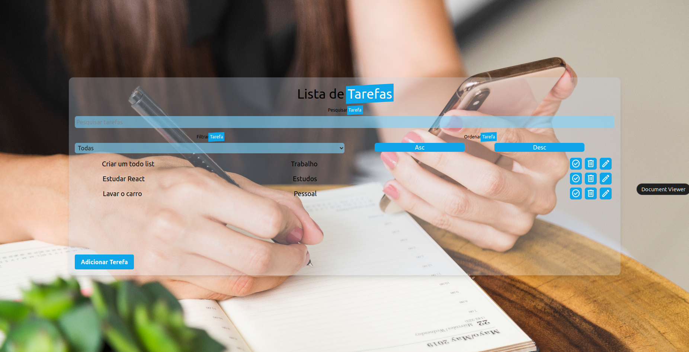
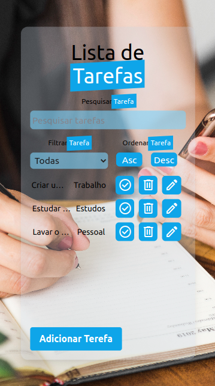

# Todo List com React, Vite e MySQL

Um projeto de Todo List desenvolvido utilizando React, Vite e um banco de dados em MySQL para armazenar as tarefas, banco de dados com **docker-compose** implementado.



<p align="center">
  
</p>


## Funcionalidades

###### Utilizado C.R.U.D

- **C** Create: Adicionar tarefas ao banco de dados
- **R** Read: Lê a tarefa no banco de dados
- **U** Update: Edita/Atualiza a tarefa na base de dados
- **D** Delete: Deleta uma tarefa na base de dados

###### Além do sistema de ordenação e filtragens
- Pesquisar tarefas por nome
- Ordenar tarefas em ordem ascendente ou descendente
- Marcar tarefas como completas ou incompletas
- Filtrar tarefas por completas e incompletas

## Pré-requisitos

- Node.js instalado (versão 16 ou superior)
- MySQL instalado (versão 8.0.29 ou superior)

## Bibliotecas usadas

### FRONT-END
- Axios
- React-icons
- React-toastify
- Tailwind
- Vite

### BACK-END
- Express
- Mysql
- Nodemon
- Cors
###### BACK-END - TESTES
- Mocha
- Chai
- Sinon

## Instalação

###### Server: TODO-LIST-FULL/API
cd todo-list-full/api

**Para usar o docker-compose rode o seguinte comando dentro da pasta /api**
```
# em um terminal, inicie os containers
docker-compose up -d

# acesse o terminal do container inicie a aplicação
docker exec -it todolist_api bash
npm start
# ou para iniciar com live-reload
npm run dev
```

###### Client: TODO-LIST-FULL
cd todo-list-full
```
# em outro terminal, rode a aplicação com vite
# confirme se o banco de dados está rodando porta 33060 e node porta 3001
# Aplicação do vite irá funcionar na porta local, apos linha de comando *npm run dev*

npm install
npm run dev
```

# 1. Clone o repositório:

```
git clone git@github.com:ronaldocerenza/todo-list-full.git
```

